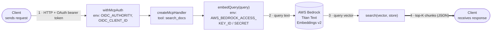
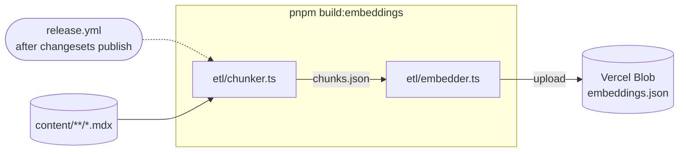

# marigold-docs MCP server

An MCP ([Model Context Protocol](https://modelcontextprotocol.io)) server that exposes one tool, `search_docs`, so AI coding assistants can semantically search the Marigold documentation. It ships as a route inside the `@marigold/docs` Next.js app. There is no standalone process, no separate deploy, and no separate repo.

For the user-facing setup guide (how to connect Claude Code / VS Code, prompting tips, limitations), see [`docs/content/getting-started/usage-with-ai/index.mdx`](../../content/getting-started/usage-with-ai/index.mdx). This document covers the implementation.

## Architecture



`ClientOut` and `ClientIn` are the same client, drawn twice. One box is for the outgoing call, the other for the response, so the diagram reads as a straight line instead of looping back on itself. `Auth`, `Handler`, `Embed`, and `Search` are steps inside `route.ts`. `Bedrock` is the one external call in the middle of that chain. The numbers trace one live request from start to finish. The call comes in (1), gets embedded via Bedrock (2, 3), and the ranked chunks go back out as the tool's JSON result (4). That result is the only output this server ever produces.

None of these boxes hold their own state or secrets at request time. Everything they depend on is already in place before a request arrives.

- `Auth` and `Embed` are configured from Vercel project env vars, shown on the boxes above. See [Auth](#auth) for what each one does.
- `Search` reads `embeddings.json` from local disk, lazily, on first use. That file is baked into this function at build time from Vercel Blob on every release. `Search` never talks to Blob directly. See [Data pipeline](#data-pipeline).

Everything except the external Bedrock call lives in [`route.ts`](./route.ts):

- **Transport.** Streamable HTTP via `createMcpHandler` from the `mcp-handler` package (wraps `@modelcontextprotocol/sdk`). The route exports `GET`, `POST`, and `DELETE`, all pointing at the same handler.
- **Tool.** There is exactly one, `search_docs(query: string, limit?: number)` (`route.ts:176-229`). `query` is 1–1000 chars. `limit` is 3–10, default 5.
- **Search.** A brute-force dot-product top-K scan over the in-memory vector store (`route.ts:110-136`). There is no approximate-nearest-neighbor index. The corpus is small enough (roughly one doc page times a few chunks each) that a linear scan is fast enough per request.
- **Runtime.** `export const runtime = 'nodejs'` and `dynamic = 'force-dynamic'` (`route.ts:17-18`). This is a Node.js serverless function, not an Edge function, and it is never statically cached.

## Data pipeline

The server never talks to a database. It reads a single static file, `lib/markdown/embeddings.json`, produced by an offline ETL pipeline that runs separately from the normal docs build.



The release pipeline stops at the upload. Getting the file back down and into `route.ts` happens later, in two separate, decoupled steps.

- **At Vercel's next build**, triggered by the same release but a different process: [`next.config.mjs`](../../next.config.mjs) runs [`scripts/download-embeddings.mjs`](../../scripts/download-embeddings.mjs) when `process.env.VERCEL` is set. This pulls `embeddings.json` from Blob down to `lib/markdown/embeddings.json`, so it gets bundled into the deployed function via `outputFileTracingIncludes`.
- **At the first `search_docs` call** after that deploy, `route.ts`'s `Search` step lazily reads the now-local file into memory (see [Architecture](#architecture)). `Blob` itself is never touched at request time.

Run the chunk and embed step with:

```bash
pnpm build:embeddings
```

- [`etl/chunker.ts`](../../lib/markdown/etl/chunker.ts) splits each doc by H2/H3 headings, never inside a code fence, and recursively re-splits anything over 10,000 characters, writing `etl/chunks.json`.
- [`etl/embedder.ts`](../../lib/markdown/etl/embedder.ts) embeds each chunk via AWS Bedrock (Titan v2, 512 dims, `eu-central-1`, see [`etl/config.ts`](../../lib/markdown/etl/config.ts)). It is rate-limited to a 280k-token/min budget with 5-way concurrency, then uploads the result to Vercel Blob.

`build:embeddings` is defined in `docs/package.json` as `zx ./scripts/build-embeddings.mjs`, which just runs `chunker.ts` then `embedder.ts` (see [`scripts/build-embeddings.mjs`](../../scripts/build-embeddings.mjs)). It's **not** part of `pnpm build` / `pnpm dev`. It requires AWS Bedrock credentials and a Vercel Blob token, so it isn't run locally as part of the usual dev/build loop.

It doesn't need to be run by hand though, that's what the `Trigger` node above stands for. The "Rebuild search embeddings" step in [`.github/workflows/release.yml`](../../../.github/workflows/release.yml) runs `pnpm --filter @marigold/docs build:embeddings` automatically after every successful changesets publish on `main`, before the `docs` branch (which Vercel builds for production) is updated. So every release re-indexes the docs. Production's `search_docs` results always reflect the docs as of the latest release, not a stale manual snapshot.

Each stored chunk (`route.ts`'s `StoredChunk` type) carries:

- `originalText` holds the raw chunk body, returned to the caller as-is.
- `metadata: { file, heading }` is used for the `metadata` field in tool results, not for ranking.
- `embedding` holds a Titan v2 vector, base64-encoded as little-endian float32 so it's portable across amd64/arm64, decoded lazily into a `Float32Array` when the store loads.

`embeddings.json` itself is **not committed to git**. It's fetched from Vercel Blob (`download-embeddings.mjs`) and baked into the deployed function bundle at build time via Next.js's `outputFileTracingIncludes`. The index is a build-time snapshot, but the release workflow rebuilds it on every release (see above), so that snapshot is refreshed automatically each time. You don't need to trigger it separately when docs content changes.

## Auth

The tool is gated behind OAuth (Keycloak/OIDC), required on every call.

- `withMcpAuth(handler, verifyToken, { required: true, resourceMetadataPath: '/.well-known/oauth-protected-resource' })` (`route.ts:239-244`)
- `verifyToken` (`route.ts:147-170`) verifies the bearer JWT against Keycloak's remote JWKS (`${OIDC_AUTHORITY}/protocol/openid-connect/certs`), checking `issuer` and `audience` (`OIDC_CLIENT_ID`)
- [`app/.well-known/oauth-protected-resource/route.ts`](../.well-known/oauth-protected-resource/route.ts) serves the OAuth protected-resource metadata the MCP client needs to discover the auth server. It deliberately restricts `scopes_supported` to `['openid']`. Without this, VS Code requests every Keycloak scope and fails with "Invalid scopes" for clients that aren't assigned all of them.

Required env vars (all optional at build time so `pnpm build` works locally without secrets, see `.changeset/docs-optional-env-vars.md`):

| Var                                                           | Purpose                                                                                           |
| ------------------------------------------------------------- | ------------------------------------------------------------------------------------------------- |
| `OIDC_AUTHORITY`                                              | Keycloak realm base URL (issuer + JWKS endpoint)                                                  |
| `OIDC_CLIENT_ID`                                              | Expected JWT audience                                                                             |
| `AWS_BEDROCK_ACCESS_KEY_ID` / `AWS_BEDROCK_SECRET_ACCESS_KEY` | Bedrock credentials, used both at query time (`embedQuery`) and at embed time (`etl/embedder.ts`) |
| `BLOB_READ_WRITE_TOKEN`                                       | Vercel Blob access, used by `embedder.ts` (upload) and `download-embeddings.mjs` (download)       |

All five vars above live in Vercel (see [Deployment](#deployment)). Nothing is configured outside the `@marigold/docs` Vercel project.

## Deployment

The server ships as part of the `@marigold/docs` Next.js app on Vercel. `pnpm build` / `pnpm start` for this app are the MCP server's build and start. There's no dedicated `mcp:build` or `mcp:start` script. Aside from the Next.js app itself, Vercel is where everything else related to this server lives too. The Blob store holding `embeddings.json`, the Bedrock access keys, and the Keycloak/OIDC config (`OIDC_AUTHORITY`, `OIDC_CLIENT_ID`) are all project environment variables in the same Vercel project. Nothing is configured elsewhere.

- **Production**: `https://www.marigold-ui.io/mcp`
- **Local dev**: `http://localhost:3000/mcp` (via `pnpm dev`), though `search_docs` will fail without a local `embeddings.json` and Bedrock credentials
- **Preview deploys**: each branch gets its own Vercel preview build, so its own `/mcp` URL too. But that build downloads the same `embeddings.json` as production, from the same shared Vercel Blob. Only [`.github/workflows/release.yml`](../../../.github/workflows/release.yml) regenerates that file, and only on pushes to `main`. A preview build never runs `build:embeddings` itself, it just downloads whatever the last release uploaded. So every branch, preview or production, searches against the same index. There is no per-branch embeddings data.

## How to connect

See [`usage-with-ai/index.mdx`](../../content/getting-started/usage-with-ai/index.mdx#mcp-server) for the full client setup snippets (Claude Code `.mcp.json` / `claude mcp add`, VS Code `.vscode/mcp.json`). In short, it's a `type: "http"` MCP server with OAuth, `clientId: dst-marigold-docs-mcp`, `callbackPort: 6749`.

The `callbackPort` is where the client's local OAuth redirect listener runs during the browser-based login. Claude Code currently uses `6749`. The Keycloak client `dst-marigold-docs-mcp` only accepts redirects to callback URLs it has explicitly allow-listed, so this is not only a client-side setting. Adding support for another tool with its own OAuth flow (Cursor, some other editor, and so on) also means registering that tool's callback port as an allowed redirect URI on the Keycloak client first. Otherwise its login attempt fails with a redirect/URI mismatch. That's configured in Keycloak, not in this repo.

## Limitations

- **Snapshot as of the latest release.** The index is rebuilt automatically on every release (see [Data pipeline](#data-pipeline)), so production always matches the latest released docs, but not commits merged since then, and not local edits before a release ships.
- **Search, not generation.** `search_docs` returns ranked text chunks. The calling agent still writes the code. Treat the output like any other AI-generated code.

## Where things live

| If you want to change...                                    | Look at                                                                                                                |
| ----------------------------------------------------------- | ---------------------------------------------------------------------------------------------------------------------- |
| The tool itself, its schema, search logic, or auth wiring   | [`route.ts`](./route.ts)                                                                                               |
| What the OAuth discovery metadata advertises                | [`app/.well-known/oauth-protected-resource/route.ts`](../.well-known/oauth-protected-resource/route.ts)                |
| How docs get split into chunks                              | [`lib/markdown/etl/chunker.ts`](../../lib/markdown/etl/chunker.ts)                                                     |
| The embedding model, dimensions, or AWS region              | [`lib/markdown/etl/config.ts`](../../lib/markdown/etl/config.ts)                                                       |
| How chunks get embedded and uploaded                        | [`lib/markdown/etl/embedder.ts`](../../lib/markdown/etl/embedder.ts)                                                   |
| The `build:embeddings` script itself                        | [`scripts/build-embeddings.mjs`](../../scripts/build-embeddings.mjs)                                                   |
| How the built file gets pulled into a Vercel build          | [`scripts/download-embeddings.mjs`](../../scripts/download-embeddings.mjs), [`next.config.mjs`](../../next.config.mjs) |
| When and how embeddings get rebuilt in CI                   | [`.github/workflows/release.yml`](../../../.github/workflows/release.yml)                                              |
| The client-facing setup instructions (Claude Code, VS Code) | [`usage-with-ai/index.mdx`](../../content/getting-started/usage-with-ai/index.mdx)                                     |
| This repo's own MCP client config                           | repo-root [`.mcp.json`](../../../.mcp.json), [`.vscode/mcp.json`](../../../.vscode/mcp.json)                           |
