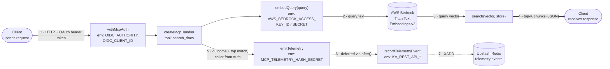
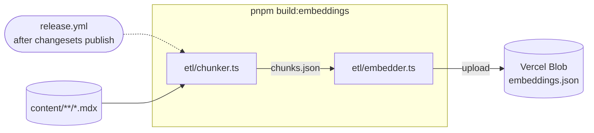

# marigold-docs MCP server

An MCP ([Model Context Protocol](https://modelcontextprotocol.io)) server that exposes one tool, `search_docs`, so AI coding assistants can semantically search the Marigold documentation. It ships as a route inside the `@marigold/docs` Next.js app. There is no standalone process, no separate deploy, and no separate repo.

For the user-facing setup guide (how to connect Claude Code / VS Code, prompting tips, limitations), see [`docs/content/getting-started/usage-with-ai/index.mdx`](../../content/getting-started/usage-with-ai/index.mdx). This document covers the implementation.

## Architecture


```mermaid
flowchart LR
    ClientOut(["Client<br/>sends request"])
    Auth["withMcpAuth<br/>env: OIDC_AUTHORITY,<br/>OIDC_CLIENT_ID"]
    Handler["createMcpHandler<br/>tool: search_docs"]
    Embed["embedQuery(query)<br/>env: AWS_BEDROCK_ACCESS_<br/>KEY_ID / SECRET"]
    Bedrock[("AWS Bedrock<br/>Titan Text<br/>Embeddings v2")]
    Search["search(vector, store)"]
    ClientIn(["Client<br/>receives response"])
    Emit["emitTelemetry<br/>env: MCP_TELEMETRY_HASH_SECRET"]
    Record["recordTelemetryEvent<br/>env: KV_REST_API_*"]
    Redis[("Upstash Redis<br/>telemetry:events")]

    ClientOut -- "1 · HTTP + OAuth bearer token" --> Auth
    Auth --> Handler --> Embed
    Embed -- "2 · query text" --> Bedrock
    Bedrock -- "3 · query vector" --> Search
    Search == "4 · top-K chunks (JSON)" ==> ClientIn
    Handler -- "5 · outcome + top match,<br/>caller from Auth" --> Emit
    Emit -. "6 · deferred via after()" .-> Record
    Record -. "7 · XADD" .-> Redis
```

`ClientOut` and `ClientIn` are the same client, drawn twice. One box is for the outgoing call, the other for the response, so the diagram reads as a straight line instead of looping back on itself. `Auth`, `Handler`, `Embed`, `Search`, and `Emit` are steps inside `route.ts`; `Record` is the shared recording helper in [`app/api/telemetry/record.ts`](../api/telemetry/record.ts). `Bedrock` and `Redis` are the two external calls, and the numbers trace one live request from start to finish. The call comes in (1), gets embedded via Bedrock (2, 3), and the ranked chunks go back out as the tool's JSON result (4). That result is the only thing the _caller_ ever sees.

Steps 5–7 are a side effect the caller never observes. `Emit` hangs off `Handler`, not off `Search`, because it fires on **every** outcome: a Bedrock failure never reaches `Search` but still records `success: false`. Its inputs come from two places — the outcome and top match from the search, the caller's hashed id from the token `Auth` already verified.

`Emit` runs synchronously in-request, deliberately, so `latencyMs` measures the search rather than whenever the deferred work happened to run — but it only _builds_ the event and hands it to Next's `after()`. The dashed edges are the deferred part: the Redis write happens once the response is already on its way out, so it can neither delay nor fail the search. See [Telemetry](#telemetry).

No box reaches outside the process at request time except the two external calls, and the only request-time secrets are the env vars on the boxes. What state there is, is all cross-request rather than per-request: `Auth`, `Embed`, and `Search` memoize a JWKS set, a Bedrock client, and the vector store on first use, and `Emit` remembers which telemetry failures it has already logged so it can warn once per instance instead of once per call.

- `Auth`, `Embed`, `Emit`, and `Record` are configured from Vercel project env vars, shown on the boxes above. See [Auth](#auth) for what each one does.
- `Search` reads `embeddings.json` from local disk, lazily, on first use. That file is baked into this function at build time from Vercel Blob on every release. `Search` never talks to Blob directly. See [Data pipeline](#data-pipeline).

Everything above lives in [`route.ts`](./route.ts) except the two external calls and `Record`. References below are by symbol name rather than line number, since line numbers go stale the moment anything above them shifts:

- **Transport.** Streamable HTTP via `createMcpHandler` from the `mcp-handler` package (wraps `@modelcontextprotocol/sdk`). The route exports `GET`, `POST`, and `DELETE`, all pointing at the same handler.
- **Tool.** There is exactly one, `search_docs(query: string, limit?: number)` — described by `SEARCH_DOCS_DESCRIPTION`, typed by `SEARCH_DOCS_SCHEMA`, implemented by `searchDocsHandler`. `query` is 1–1000 chars. `limit` is 3–10, default 5. `searchDocsHandler` is exported separately from the `server.tool()` registration so it can be unit-tested without standing up the MCP transport and auth chain (see [`route.test.ts`](./route.test.ts)).
- **Search.** A brute-force dot-product top-K scan over the in-memory vector store (`search`). There is no approximate-nearest-neighbor index. The corpus is small enough (roughly one doc page times a few chunks each) that a linear scan is fast enough per request.
- **Telemetry.** One event per tool call, written after the response. Built by `emitTelemetry` inside `searchDocsHandler`, using the module-level `hashCallerId`. See [Telemetry](#telemetry).
- **Runtime.** `export const runtime = 'nodejs'` and `dynamic = 'force-dynamic'`. This is a Node.js serverless function, not an Edge function, and it is never statically cached.

## Data pipeline

The server never talks to a database. It reads a single static file, `lib/markdown/embeddings.json`, produced by an offline ETL pipeline that runs separately from the normal docs build.


```mermaid
flowchart LR
    Trigger(["release.yml<br/>after changesets publish"])
    MDX[("content/**/*.mdx")]

    subgraph BE["pnpm build:embeddings"]
        direction LR
        Chunker["etl/chunker.ts"]
        Embedder["etl/embedder.ts"]
        Chunker -- "chunks.json" --> Embedder
    end

    Blob[("Vercel Blob<br/>embeddings.json")]

    Trigger -.-> Chunker
    MDX --> Chunker
    Embedder -- upload --> Blob
```

The release pipeline stops at the upload. Getting the file back down and into `route.ts` happens later, in two separate, decoupled steps.

- **At Vercel's next build**, triggered by the same release but a different process: [`next.config.mjs`](../../next.config.mjs) runs [`scripts/download-embeddings.mjs`](../../scripts/download-embeddings.mjs) when `process.env.VERCEL` is set. This pulls `embeddings.json` from Blob down to `lib/markdown/embeddings.json`, so it gets bundled into the deployed function via `outputFileTracingIncludes`.
- **At the first `search_docs` call** after that deploy, `route.ts`'s `Search` step lazily reads the now-local file into memory (see [Architecture](#architecture)). `Blob` itself is never touched at request time.

Run the chunk and embed step with:

```bash
pnpm build:embeddings
```

- [`etl/chunker.ts`](../../lib/markdown/etl/chunker.ts) splits each doc by H2/H3 headings, never inside a code fence, and recursively re-splits anything over 10,000 characters, writing `etl/chunks.json`.
- [`etl/embedder.ts`](../../lib/markdown/etl/embedder.ts) embeds each chunk via AWS Bedrock (Titan v2, 512 dims, `eu-central-1`, see [`etl/config.ts`](../../lib/markdown/etl/config.ts)). It is rate-limited to a 280k-token/min budget with 5-way concurrency, then uploads the result to Vercel Blob.

`build:embeddings` is defined in `docs/package.json` as `zx ./scripts/build-embeddings.mjs`, which just runs `chunker.ts` then `embedder.ts` (see [`scripts/build-embeddings.mjs`](../../scripts/build-embeddings.mjs)). It's **not** part of `pnpm build` / `pnpm dev`. It requires AWS Bedrock credentials and a Vercel Blob token, so it isn't run locally as part of the usual dev/build loop.

It doesn't need to be run by hand though, that's what the `Trigger` node above stands for. The "Rebuild search embeddings" step in [`.github/workflows/release.yml`](../../../.github/workflows/release.yml) runs `pnpm --filter @marigold/docs build:embeddings` automatically after every successful changesets publish on `main`, before the `docs` branch (which Vercel builds for production) is updated. So every release re-indexes the docs. Production's `search_docs` results always reflect the docs as of the latest release, not a stale manual snapshot.

Each stored chunk (`route.ts`'s `StoredChunk` type) carries:

- `originalText` holds the raw chunk body, returned to the caller as-is.
- `metadata: { file, heading }` is used for the `metadata` field in tool results, not for ranking.
- `embedding` holds a Titan v2 vector, base64-encoded as little-endian float32 so it's portable across amd64/arm64, decoded lazily into a `Float32Array` when the store loads.

`embeddings.json` itself is **not committed to git**. It's fetched from Vercel Blob (`download-embeddings.mjs`) and baked into the deployed function bundle at build time via Next.js's `outputFileTracingIncludes`. The index is a build-time snapshot, but the release workflow rebuilds it on every release (see above), so that snapshot is refreshed automatically each time. You don't need to trigger it separately when docs content changes.

## Auth

The tool is gated behind OAuth (Keycloak/OIDC), required on every call.

- `withMcpAuth(handler, verifyToken, { required: true, resourceMetadataPath: '/.well-known/oauth-protected-resource' })` (`authOptions` + `mcpHandler` at the bottom of `route.ts`)
- `verifyToken` verifies the bearer JWT against Keycloak's remote JWKS (`${OIDC_AUTHORITY}/protocol/openid-connect/certs`), checking `issuer` and `audience` (`OIDC_CLIENT_ID`)
- [`app/.well-known/oauth-protected-resource/route.ts`](../.well-known/oauth-protected-resource/route.ts) serves the OAuth protected-resource metadata the MCP client needs to discover the auth server. It deliberately restricts `scopes_supported` to `['openid']`. Without this, VS Code requests every Keycloak scope and fails with "Invalid scopes" for clients that aren't assigned all of them.

Required env vars (all optional at build time so `pnpm build` works locally without secrets, see `.changeset/docs-optional-env-vars.md`):

| Var                                                           | Purpose                                                                                           |
| ------------------------------------------------------------- | ------------------------------------------------------------------------------------------------- |
| `OIDC_AUTHORITY`                                              | Keycloak realm base URL (issuer + JWKS endpoint)                                                  |
| `OIDC_CLIENT_ID`                                              | Expected JWT audience                                                                             |
| `AWS_BEDROCK_ACCESS_KEY_ID` / `AWS_BEDROCK_SECRET_ACCESS_KEY` | Bedrock credentials, used both at query time (`embedQuery`) and at embed time (`etl/embedder.ts`) |
| `BLOB_READ_WRITE_TOKEN`                                       | Vercel Blob access, used by `embedder.ts` (upload) and `download-embeddings.mjs` (download)       |
| `MCP_TELEMETRY_HASH_SECRET`                                   | HMAC key for hashing the caller's Keycloak `sub`; unset means MCP telemetry is skipped entirely   |
| `KV_REST_API_URL` / `KV_REST_API_TOKEN`                       | Upstash Redis, where telemetry events are persisted; unset means telemetry is skipped entirely    |

All eight vars above live in Vercel (see [Deployment](#deployment)). Nothing is configured outside the `@marigold/docs` Vercel project. At request time a `search_docs` call only needs the `OIDC_*` and `AWS_BEDROCK_*` vars — `BLOB_READ_WRITE_TOKEN` is build-time only (see [Data pipeline](#data-pipeline)), and the three telemetry vars only turn recording on or off (see [Telemetry](#telemetry)).

## Telemetry

Every `search_docs` call records one event so [Insights](https://github.com/marigold-ui/insights) can report call volume, unique callers, error rate, and top-searched doc topics. It reuses the same Redis-backed store the CLI's telemetry already writes to, rather than adding a second datastore — one `telemetry:events` stream carrying both sources, discriminated on `event`.

Recorded per call: `hashedCallerId`, `latencyMs`, `success`, and `topMatchFile` / `topMatchHeading` (the best-matching chunk, absent on failure or no results). **No query text and no similarity scores.**

- **The caller is pseudonymous, not anonymous.** `hashCallerId` runs the Keycloak `sub` claim through HMAC-SHA256 keyed on `MCP_TELEMETRY_HASH_SECRET` before it leaves the process; the raw claim identifies an individual Reservix employee and is never written anywhere. But the digest is _stable_ for as long as the secret is — that's what makes unique-caller counts possible at all, and it also means the store holds a per-person, per-day record of which doc pages that pseudonym searched. Anyone holding both Redis read access and the secret can re-identify a known `sub`. Treat the secret as a credential, rotate it to break linkability across periods, and see the retention note below.
- **The write cannot affect the response.** `emitTelemetry` builds the event, then hands the Redis write to Next's [`after()`](https://nextjs.org/docs/app/api-reference/functions/after), which runs it once the response is already on its way out. The event is built _before_ `after()` is called, not inside its callback, so `latencyMs` measures the embed+search and not whenever the deferred callback happened to run. The whole thing is wrapped in a `try`/`catch` so even a synchronous throw from `after()` itself — which is what Next does when there's no request scope — can't turn a successful search into a reported failure.
- **Nothing recorded is ever a hard failure, but it is never silent either.** Every way telemetry can fail is systematic: whatever breaks one call breaks all of them for the life of that instance. So each distinct cause is logged **once per process** rather than once per call — loud enough to diagnose an empty dashboard, quiet enough not to fill the logs. The causes are a missing `MCP_TELEMETRY_HASH_SECRET`, `after()` throwing, and `recordTelemetryEvent` returning `'rate-limited'`, `'invalid'` (the event failed its own schema — a bug on our side), or `'error'` (the Redis call failed). The one exception is `'unconfigured'`, i.e. no `KV_REST_API_*`: that's the normal steady state in local dev and preview deploys, so it stays silent. `search_docs` behaves identically in all of them.

**Events are retained for roughly 200 days, and the bound is deliberate.** Events go into one `telemetry:events` stream rather than one list per UTC day, and `record.ts` trims it with `MINID ~` on every `XADD` — so retention rides along on the write path rather than needing its own job, and the store cannot grow without limit the way the daily lists could. The window is sized against its one real consumer: Insights' widest view is 90 days and its KPI deltas compare against the preceding 90, so **180 days have to survive**. 200 leaves that margin. At this volume — a few hundred events a day at roughly 250 bytes each — size was never the constraint; the point is that the ceiling is now stated somewhere rather than being whatever the store happens to have accumulated. Compliance was signed off separately on DST-1625: this is Reservix-internal telemetry, so no external retention window is imposed.

That 180-day floor is a cross-repo constraint with nothing enforcing it: `RETENTION_DAYS` lives here, the window that depends on it lives in [Insights](https://github.com/marigold-ui/insights). Widening Insights' range past 180 days does not fail anything on this side — the tail is simply trimmed away, which reads as a drop in usage rather than an error. If that range grows, `RETENTION_DAYS` has to grow with it.

Note that the caller pseudonym is stable for as long as `MCP_TELEMETRY_HASH_SECRET` is, so rotating that secret is what breaks linkability across periods, not retention.

The recording itself lives outside this directory, in [`app/api/telemetry/`](../api/telemetry/), and is shared with the CLI:

- [`schema.ts`](../api/telemetry/schema.ts) — one discriminated union over `cli_command` and `mcp_tool_call`, so both sources share a single validated contract. `cli_command`'s `command` enum must track the CLI's `CommandName` union; an unknown command is a 400 and the CLI is fire-and-forget, so drift silently drops every event for the new command. That list lives in [`commands.ts`](../api/telemetry/commands.ts); `api/telemetry/commands.test.ts` reads the union out of the CLI source and fails on drift.
- [`record.ts`](../api/telemetry/record.ts) — rate limiting and the Redis write. `route.ts` calls this **in-process**; the server never POSTs to itself. The quota is 1000/day per caller, keyed `cli:{anonymousId}` or `mcp:{hashedCallerId}`. On the public endpoint that bounds abuse; for MCP events, where the id comes from a verified JWT, it only caps one caller's share of the stream. A caller past the quota is dropped, not truncated, so the ceiling sits far above realistic usage — but it does mean a single caller exceeding 1000 calls in a UTC day would under-report.
- [`route.ts`](../api/telemetry/route.ts) — the public `POST /api/telemetry` endpoint the CLI uses. It deliberately accepts **only** `cli_command` events, never `mcp_tool_call`: an MCP event's rate-limit key comes from its own `hashedCallerId` field, so accepting one over an unauthenticated endpoint would make call volume and unique-caller counts forgeable without bound. MCP events reach `record.ts` in-process only.

## Deployment

The server ships as part of the `@marigold/docs` Next.js app on Vercel. `pnpm build` / `pnpm start` for this app are the MCP server's build and start. There's no dedicated `mcp:build` or `mcp:start` script. Aside from the Next.js app itself, Vercel is where everything else related to this server lives too. The Blob store holding `embeddings.json`, the Bedrock access keys, and the Keycloak/OIDC config (`OIDC_AUTHORITY`, `OIDC_CLIENT_ID`) are all project environment variables in the same Vercel project. Nothing is configured elsewhere.

- **Production**: `https://www.marigold-ui.io/mcp`
- **Local dev**: `http://localhost:3000/mcp` (via `pnpm dev`), though `search_docs` will fail without a local `embeddings.json` and Bedrock credentials
- **Preview deploys**: each branch gets its own Vercel preview build, so its own `/mcp` URL too. But that build downloads the same `embeddings.json` as production, from the same shared Vercel Blob. Only [`.github/workflows/release.yml`](../../../.github/workflows/release.yml) regenerates that file, and only on pushes to `main`. A preview build never runs `build:embeddings` itself, it just downloads whatever the last release uploaded. So every branch, preview or production, searches against the same index. There is no per-branch embeddings data.

## How to connect

See [`usage-with-ai/index.mdx`](../../content/getting-started/usage-with-ai/index.mdx#mcp-server) for the full client setup snippets (Claude Code `.mcp.json` / `claude mcp add`, VS Code `.vscode/mcp.json`). In short, it's a `type: "http"` MCP server with OAuth, `clientId: dst-marigold-docs-mcp`, `callbackPort: 6749`.

The `callbackPort` is where the client's local OAuth redirect listener runs during the browser-based login. Claude Code currently uses `6749`. The Keycloak client `dst-marigold-docs-mcp` only accepts redirects to callback URLs it has explicitly allow-listed, so this is not only a client-side setting. Adding support for another tool with its own OAuth flow (Cursor, some other editor, and so on) also means registering that tool's callback port as an allowed redirect URI on the Keycloak client first. Otherwise its login attempt fails with a redirect/URI mismatch. That's configured in Keycloak, not in this repo.

## Limitations

- **Snapshot as of the latest release.** The index is rebuilt automatically on every release (see [Data pipeline](#data-pipeline)), so production always matches the latest released docs, but not commits merged since then, and not local edits before a release ships.
- **Search, not generation.** `search_docs` returns ranked text chunks. The calling agent still writes the code. Treat the output like any other AI-generated code.

## Where things live

| If you want to change...                                      | Look at                                                                                                                |
| ------------------------------------------------------------- | ---------------------------------------------------------------------------------------------------------------------- |
| The tool itself, its schema, search logic, or auth wiring     | [`route.ts`](./route.ts)                                                                                               |
| What gets recorded per tool call, or how the caller is hashed | [`route.ts`](./route.ts) (`hashCallerId`, `emitTelemetry`)                                                             |
| Rate limiting, the Redis keyspace, or the event schema        | [`app/api/telemetry/record.ts`](../api/telemetry/record.ts), [`schema.ts`](../api/telemetry/schema.ts)                 |
| What the OAuth discovery metadata advertises                  | [`app/.well-known/oauth-protected-resource/route.ts`](../.well-known/oauth-protected-resource/route.ts)                |
| How docs get split into chunks                                | [`lib/markdown/etl/chunker.ts`](../../lib/markdown/etl/chunker.ts)                                                     |
| The embedding model, dimensions, or AWS region                | [`lib/markdown/etl/config.ts`](../../lib/markdown/etl/config.ts)                                                       |
| How chunks get embedded and uploaded                          | [`lib/markdown/etl/embedder.ts`](../../lib/markdown/etl/embedder.ts)                                                   |
| The `build:embeddings` script itself                          | [`scripts/build-embeddings.mjs`](../../scripts/build-embeddings.mjs)                                                   |
| How the built file gets pulled into a Vercel build            | [`scripts/download-embeddings.mjs`](../../scripts/download-embeddings.mjs), [`next.config.mjs`](../../next.config.mjs) |
| When and how embeddings get rebuilt in CI                     | [`.github/workflows/release.yml`](../../../.github/workflows/release.yml)                                              |
| The client-facing setup instructions (Claude Code, VS Code)   | [`usage-with-ai/index.mdx`](../../content/getting-started/usage-with-ai/index.mdx)                                     |
| This repo's own MCP client config                             | repo-root [`.mcp.json`](../../../.mcp.json), [`.vscode/mcp.json`](../../../.vscode/mcp.json)                           |
